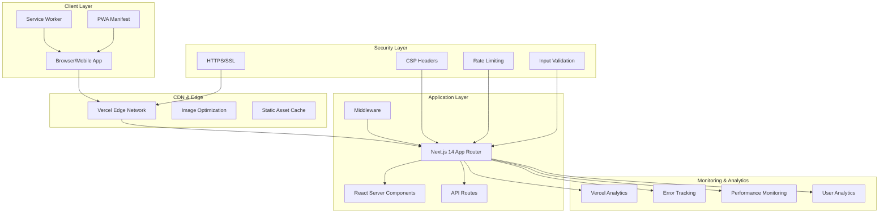

# Production Readiness Design Document

## Overview

This design document outlines the technical architecture and implementation strategy for making the bibiere luxury fashion e-commerce website production-ready. The design focuses on performance optimization, security hardening, monitoring implementation, SEO enhancement, and operational reliability using Next.js 14 with modern web standards.

## Architecture

### High-Level Architecture



### Performance Architecture

The performance optimization strategy leverages Next.js 14's built-in optimizations and modern web standards:

- **Static Generation**: Pre-render product pages and collections at build time
- **Incremental Static Regeneration (ISR)**: Update product data without full rebuilds
- **Edge Runtime**: Deploy API routes to edge locations for reduced latency
- **Image Optimization**: Automatic WebP/AVIF conversion with responsive sizing
- **Code Splitting**: Automatic route-based and component-based splitting
- **Bundle Optimization**: Tree shaking, minification, and compression

## Components and Interfaces

### Performance Monitoring System

```typescript
interface PerformanceMetrics {
  coreWebVitals: {
    lcp: number; // Largest Contentful Paint
    fid: number; // First Input Delay
    cls: number; // Cumulative Layout Shift
    fcp: number; // First Contentful Paint
    ttfb: number; // Time to First Byte
  };
  customMetrics: {
    pageLoadTime: number;
    apiResponseTime: number;
    imageLoadTime: number;
    searchResponseTime: number;
  };
  userExperience: {
    bounceRate: number;
    sessionDuration: number;
    pagesPerSession: number;
    conversionRate: number;
  };
}

interface PerformanceMonitor {
  trackMetrics(metrics: PerformanceMetrics): void;
  reportToAnalytics(data: AnalyticsEvent): void;
  alertOnThreshold(metric: string, threshold: number): void;
  generateReport(): PerformanceReport;
}
```

### SEO Optimization System

```typescript
interface SEOMetadata {
  title: string;
  description: string;
  keywords: string[];
  openGraph: {
    title: string;
    description: string;
    image: string;
    url: string;
    type: string;
  };
  twitter: {
    card: string;
    title: string;
    description: string;
    image: string;
  };
  structuredData: {
    '@type': string;
    name: string;
    description: string;
    image: string[];
    brand: string;
    offers?: ProductOffer;
  };
}

interface SEOManager {
  generateMetadata(page: PageType, data?: any): SEOMetadata;
  generateStructuredData(type: 'Product' | 'Organization' | 'BreadcrumbList'): object;
  optimizeImages(images: ImageData[]): OptimizedImage[];
  generateSitemap(): SitemapEntry[];
}
```

### Security Framework

```typescript
interface SecurityConfig {
  csp: {
    directives: Record<string, string[]>;
    reportUri?: string;
  };
  headers: {
    hsts: boolean;
    xFrameOptions: string;
    xContentTypeOptions: boolean;
    referrerPolicy: string;
  };
  rateLimit: {
    windowMs: number;
    maxRequests: number;
    skipSuccessfulRequests: boolean;
  };
  validation: {
    sanitizeInput: boolean;
    validateTypes: boolean;
    maxPayloadSize: number;
  };
}

interface SecurityManager {
  validateInput(input: any, schema: ValidationSchema): ValidationResult;
  sanitizeData(data: any): any;
  checkRateLimit(identifier: string): boolean;
  generateCSPNonce(): string;
  logSecurityEvent(event: SecurityEvent): void;
}
```

### Analytics and Tracking System

```typescript
interface AnalyticsEvent {
  event: string;
  category: string;
  action: string;
  label?: string;
  value?: number;
  customParameters?: Record<string, any>;
  userId?: string;
  sessionId: string;
  timestamp: Date;
}

interface ConversionTracking {
  trackPageView(page: string, userId?: string): void;
  trackProductView(productId: string, userId?: string): void;
  trackAddToCart(productId: string, quantity: number, userId?: string): void;
  trackPurchase(orderId: string, value: number, items: CartItem[]): void;
  trackSearchQuery(query: string, results: number): void;
  trackUserEngagement(action: string, element: string): void;
}
```

### Error Handling and Monitoring

```typescript
interface ErrorContext {
  userId?: string;
  sessionId: string;
  userAgent: string;
  url: string;
  timestamp: Date;
  stackTrace?: string;
  additionalData?: Record<string, any>;
}

interface ErrorManager {
  captureError(error: Error, context: ErrorContext): void;
  captureException(exception: any, context: ErrorContext): void;
  logWarning(message: string, context: Partial<ErrorContext>): void;
  createErrorBoundary(fallback: React.ComponentType): React.ComponentType;
  generateErrorReport(): ErrorReport;
}
```

## Data Models

### Performance Configuration

```typescript
interface PerformanceConfig {
  caching: {
    staticAssets: {
      maxAge: number;
      staleWhileRevalidate: number;
    };
    apiResponses: {
      maxAge: number;
      staleWhileRevalidate: number;
    };
    images: {
      maxAge: number;
      formats: string[];
      sizes: number[];
    };
  };
  optimization: {
    bundleAnalysis: boolean;
    treeShaking: boolean;
    minification: boolean;
    compression: boolean;
  };
  monitoring: {
    coreWebVitals: boolean;
    customMetrics: boolean;
    realUserMonitoring: boolean;
    syntheticMonitoring: boolean;
  };
}
```

### SEO Configuration

```typescript
interface SEOConfig {
  defaultMetadata: {
    siteName: string;
    siteUrl: string;
    defaultTitle: string;
    defaultDescription: string;
    defaultImage: string;
  };
  structuredData: {
    organization: OrganizationSchema;
    website: WebsiteSchema;
    breadcrumbs: boolean;
    products: boolean;
  };
  sitemap: {
    changeFrequency: string;
    priority: number;
    excludePaths: string[];
  };
  robots: {
    index: boolean;
    follow: boolean;
    crawlDelay?: number;
  };
}
```

### Accessibility Configuration

```typescript
interface AccessibilityConfig {
  wcag: {
    level: 'A' | 'AA' | 'AAA';
    guidelines: string[];
  };
  features: {
    skipLinks: boolean;
    focusManagement: boolean;
    ariaLabels: boolean;
    keyboardNavigation: boolean;
    screenReaderSupport: boolean;
  };
  testing: {
    automated: boolean;
    manual: boolean;
    userTesting: boolean;
  };
}
```

## Error Handling

### Global Error Boundary Strategy

```typescript
// Error boundary hierarchy
class GlobalErrorBoundary extends React.Component {
  // Catches all unhandled React errors
  // Provides fallback UI
  // Reports errors to monitoring service
}

class RouteErrorBoundary extends React.Component {
  // Catches route-specific errors
  // Provides route-specific fallback UI
  // Allows partial page recovery
}

class ComponentErrorBoundary extends React.Component {
  // Catches component-specific errors
  // Provides component-specific fallback UI
  // Maintains page functionality
}
```

### Error Recovery Mechanisms

1. **Automatic Retry**: Implement exponential backoff for API failures
2. **Graceful Degradation**: Provide fallback functionality when features fail
3. **User Feedback**: Clear error messages with actionable recovery steps
4. **Offline Support**: Cache critical functionality for offline use
5. **Error Reporting**: Comprehensive error logging and alerting

### HTTP Error Handling

```typescript
interface ErrorResponse {
  status: number;
  message: string;
  code: string;
  details?: any;
  timestamp: Date;
  requestId: string;
}

// Custom error pages
// 404: Product not found with search suggestions
// 500: Server error with retry options
// 503: Maintenance mode with estimated recovery time
```

## Testing Strategy

### Performance Testing

1. **Lighthouse CI**: Automated performance audits in CI/CD pipeline
2. **Core Web Vitals Monitoring**: Real-time monitoring of performance metrics
3. **Load Testing**: Simulate high traffic scenarios
4. **Bundle Analysis**: Monitor bundle size and optimization opportunities

### Security Testing

1. **Automated Security Scans**: OWASP ZAP integration
2. **Dependency Scanning**: Regular vulnerability assessments
3. **Penetration Testing**: Periodic security audits
4. **Input Validation Testing**: Comprehensive input sanitization tests

### Accessibility Testing

1. **Automated Testing**: axe-core integration for WCAG compliance
2. **Screen Reader Testing**: NVDA, JAWS, and VoiceOver compatibility
3. **Keyboard Navigation Testing**: Full keyboard accessibility validation
4. **Color Contrast Testing**: Ensure sufficient contrast ratios

### Cross-Browser Testing

1. **Automated Browser Testing**: Playwright/Puppeteer test suites
2. **Device Testing**: Real device testing on BrowserStack
3. **Progressive Enhancement**: Ensure functionality without JavaScript
4. **Polyfill Testing**: Validate fallbacks for older browsers

## Implementation Architecture

### Next.js Configuration Enhancements

```javascript
// Enhanced next.config.js
const nextConfig = {
  // Performance optimizations
  experimental: {
    optimizePackageImports: ['lucide-react', '@radix-ui/*'],
    webVitalsAttribution: ['CLS', 'LCP', 'FCP', 'FID', 'TTFB'],
  },
  
  // Image optimization
  images: {
    formats: ['image/avif', 'image/webp'],
    deviceSizes: [640, 750, 828, 1080, 1200, 1920, 2048, 3840],
    imageSizes: [16, 32, 48, 64, 96, 128, 256, 384],
    minimumCacheTTL: 31536000, // 1 year
    dangerouslyAllowSVG: false,
    contentSecurityPolicy: "default-src 'self'; script-src 'none'; sandbox;",
  },
  
  // Security headers
  async headers() {
    return [
      {
        source: '/(.*)',
        headers: [
          {
            key: 'X-Frame-Options',
            value: 'DENY'
          },
          {
            key: 'X-Content-Type-Options',
            value: 'nosniff'
          },
          {
            key: 'Referrer-Policy',
            value: 'strict-origin-when-cross-origin'
          },
          {
            key: 'Strict-Transport-Security',
            value: 'max-age=31536000; includeSubDomains'
          }
        ]
      }
    ];
  },
  
  // Compression and optimization
  compress: true,
  swcMinify: true,
  poweredByHeader: false,
  
  // Bundle optimization
  webpack: (config, { dev, isServer }) => {
    if (!dev && !isServer) {
      config.optimization.splitChunks.cacheGroups = {
        ...config.optimization.splitChunks.cacheGroups,
        vendor: {
          test: /[\\/]node_modules[\\/]/,
          name: 'vendors',
          chunks: 'all',
        },
      };
    }
    return config;
  },
};
```

### Service Worker Implementation

```typescript
// Progressive Web App service worker
class BibiereServiceWorker {
  private cacheName = 'bibiere-v1';
  private staticAssets = [
    '/',
    '/collections',
    '/about',
    '/manifest.json',
    // Critical CSS and JS
  ];
  
  async install() {
    // Cache critical resources
    const cache = await caches.open(this.cacheName);
    await cache.addAll(this.staticAssets);
  }
  
  async fetch(request: Request) {
    // Implement cache-first strategy for static assets
    // Network-first strategy for API calls
    // Offline fallback for critical pages
  }
  
  async backgroundSync() {
    // Sync cart data when online
    // Send analytics events
    // Update product information
  }
}
```

### Monitoring Integration

```typescript
// Performance monitoring setup
class PerformanceMonitor {
  private analytics: AnalyticsService;
  private errorReporting: ErrorReportingService;
  
  constructor() {
    this.setupWebVitalsTracking();
    this.setupCustomMetrics();
    this.setupErrorTracking();
  }
  
  private setupWebVitalsTracking() {
    // Track Core Web Vitals
    getCLS(this.reportMetric);
    getFID(this.reportMetric);
    getFCP(this.reportMetric);
    getLCP(this.reportMetric);
    getTTFB(this.reportMetric);
  }
  
  private reportMetric(metric: Metric) {
    this.analytics.track('web_vital', {
      name: metric.name,
      value: metric.value,
      rating: metric.rating,
    });
  }
}
```

### Security Implementation

```typescript
// Content Security Policy configuration
const cspConfig = {
  'default-src': ["'self'"],
  'script-src': ["'self'", "'unsafe-inline'", 'https://www.googletagmanager.com'],
  'style-src': ["'self'", "'unsafe-inline'", 'https://fonts.googleapis.com'],
  'img-src': ["'self'", 'data:', 'https:'],
  'font-src': ["'self'", 'https://fonts.gstatic.com'],
  'connect-src': ["'self'", 'https://api.bibiere.com'],
  'frame-ancestors': ["'none'"],
  'base-uri': ["'self'"],
  'form-action': ["'self'"],
};

// Input validation middleware
class InputValidator {
  static validateProductData(data: any): ValidationResult {
    // Validate product input data
    // Sanitize user inputs
    // Check for XSS attempts
  }
  
  static validateUserData(data: any): ValidationResult {
    // Validate user registration/login data
    // Check email format
    // Validate password strength
  }
}
```

This design provides a comprehensive foundation for production readiness, covering all critical aspects from performance optimization to security implementation. The modular architecture allows for incremental implementation while maintaining system reliability and user experience.